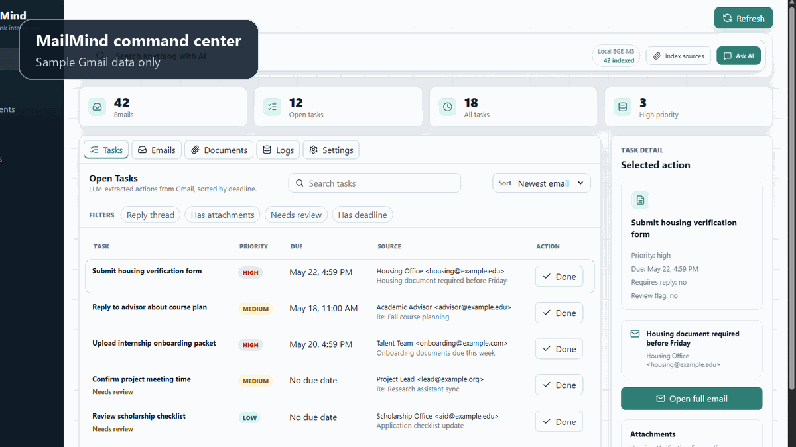

# MailMind

[English](README.md) | [涓枃](README.zh.md)

> This file is kept for compatibility. The canonical Chinese README is [README.zh.md](README.zh.md).


MailMind 鏄竴涓?local-first 鐨?Gmail 鏅鸿兘鍔╂墜銆傚畠鎶婁釜浜洪偖绠遍噷鐨勯偖浠惰浆鎹㈡垚缁撴瀯鍖栦换鍔°€佸彲鎼滅储鐭ヨ瘑鍜屽甫闅愮淇濇姢鐨?AI 鍥炵瓟銆傞」鐩娇鐢?Gmail 鍙 API銆丆laude 鎴?mock provider 鎻愬彇浠诲姟鍜?deadline锛岀敤 SQLite 鏈湴淇濆瓨鏁版嵁锛岄€氳繃 FastAPI + Next.js 鎻愪緵 dashboard锛屼篃鍙互閫氳繃 Telegram 鍙戦€佹彁閱掋€?
MailMind 鏄湰鍦板紑婧愯蒋浠讹紝涓嶆槸鎵樼 SaaS銆備换浣曚汉閮藉彲浠?clone 鍚庢湰鍦拌繍琛屻€傜湡瀹炴帴鍏?Gmail 鏃讹紝姣忎釜鐢ㄦ埛闇€瑕佸垱寤鸿嚜宸辩殑 Google OAuth desktop client锛屽洜涓?Gmail `gmail.readonly` 灞炰簬 restricted scope銆?
## 鍔熻兘

- Gmail 鍙 OAuth锛屾湰鍦版祻瑙堝櫒鎺堟潈銆?- LLM 浠诲姟鎻愬彇锛屼娇鐢?Pydantic 鏍￠獙缁撴瀯鍖栬緭鍑恒€?- SQLite 淇濆瓨 emails銆乼asks銆乤ttachments銆乸rocessing logs 鍜?settings銆?- 涓€閿?Refresh锛氭媺鍙?Gmail銆佹彁鍙栦换鍔°€佸埛鏂?dashboard銆佹洿鏂板惎鐢ㄧ殑 AI search index銆?- Telegram bot锛歚/list`銆乣/today`銆乣/done <id>`銆乣/search <keyword>`銆乣/poll`銆?- APScheduler worker锛氬彲閫夊畾鏃?polling銆乨aily digest銆乨eadline reminders銆?- Next.js dashboard锛岄潤鎬佸鍑哄悗鐢?FastAPI 鎵樼銆?- AI search 鏀寔閭欢姝ｆ枃鍜?PDF 闄勪欢锛屼娇鐢ㄦ湰鍦?BGE-M3 embedding銆丆hromaDB銆丼QLite FTS5 BM25 hybrid search銆乸arent-child retrieval銆乺eranking 鍜?Claude source-grounded answers銆?- PII Guard 鏀寔 `off` 鍜?`rehydrated` 涓ょ妯″紡銆俙rehydrated` 浼氬厛鎶?PII 鏇挎崲涓?placeholder 鍙戠粰 Claude锛屽啀鍦ㄦ湰鍦版仮澶嶇粰鐢ㄦ埛鐪嬨€?- sample/demo mode锛氭棤闇€ Gmail credentials锛屼篃鑳芥煡鐪?dashboard 鍜?README 灞曠ず绱犳潗銆?
## 鏋舵瀯

```text
Gmail API read-only OAuth
        |
        v
FastAPI backend + SQLite
        |
        +--> LLM task extraction -> tasks, deadlines, priorities
        |
        +--> AI search index -> email chunks + PDF chunks -> Chroma + SQLite FTS5
        |
        +--> Next.js dashboard served from FastAPI
        |
        +--> APScheduler worker + Telegram bot
```

## 蹇€熷紑濮嬶細Demo Mode

Demo mode 浣跨敤 sample 鏁版嵁锛屼笉闇€瑕?Gmail credentials銆乀elegram credentials 鎴?Claude key銆?
```powershell
git clone https://github.com/Parsiffal1/Mailmind.git
cd Mailmind

python -m venv .venv
.\.venv\Scripts\Activate.ps1
pip install -r requirements.txt

Copy-Item .env.example .env
```

macOS/Linux:

```bash
git clone https://github.com/Parsiffal1/Mailmind.git
cd Mailmind

python3 -m venv .venv
source .venv/bin/activate
pip install -r requirements.txt

cp .env.example .env
```

鍦?`.env` 閲岃缃細

```text
MAILMIND_LLM_PROVIDER=mock
```

鏋勫缓骞惰繍琛岋細

```powershell
cd dashboard
npm install
npm run build
cd ..

python -m mailmind.api
```

鎵撳紑锛?
```text
http://127.0.0.1:8000/?demo=1
```

## 蹇€熷紑濮嬶細鐪熷疄 Gmail

1. 鎵撳紑 Google Cloud Console銆?2. 鍒涘缓鎴栭€夋嫨涓€涓」鐩€?3. 鍚敤 Gmail API銆?4. 閰嶇疆 Google Auth Platform consent screen锛屼釜浜洪」鐩彲浣跨敤 external testing銆?5. 鍒涘缓 OAuth client ID锛岀被鍨嬮€夋嫨 `Desktop app`銆?6. 涓嬭浇 OAuth client JSON锛屼繚瀛樺埌椤圭洰鏍圭洰褰曞苟鍛藉悕涓?`credentials.json`銆?7. 鍦?Google Auth Platform 閲屾妸鑷繁鐨?Gmail 鍔犱负 test user銆?
鐒跺悗閰嶇疆 `.env`锛?
```text
MAILMIND_LLM_PROVIDER=anthropic
ANTHROPIC_API_KEY=your_anthropic_key
MAILMIND_GMAIL_CREDENTIALS=credentials.json
MAILMIND_GMAIL_TOKEN=token.json
MAILMIND_POLL_QUERY=newer_than:14d
MAILMIND_POLL_LIMIT=40
```

杩愯 API锛?
```powershell
python -m mailmind.api
```

鎵撳紑 `http://127.0.0.1:8000`锛岀偣鍑?`Refresh`锛屽畬鎴愭祻瑙堝櫒 OAuth 鎺堟潈銆傜涓€娆℃垚鍔熺櫥褰曞悗锛孧ailMind 浼氭妸 `token.json` 鍐欏湪鏈湴銆?
## Worker 鍜?Telegram Bot

鍙仛鎵嬪姩鍒锋柊鍜?dashboard demo 鏃讹紝鍚姩 API 灏卞浜嗐€?
鍙€夊惎鍔?scheduler worker锛?
```powershell
python -m mailmind.worker
```

鍙€夊惎鍔?Telegram bot锛?
```powershell
python -m mailmind.bot
```

Telegram 闇€瑕侊細

```text
TELEGRAM_BOT_TOKEN=your_bot_token
TELEGRAM_CHAT_ID=your_chat_id
MAILMIND_TELEGRAM_NOTIFICATIONS_ENABLED=true
```

## 閰嶇疆

涓昏閰嶇疆鍦?`.env` 涓紝涔熷彲浠ラ€氳繃 dashboard settings 椤甸潰淇敼銆?
```text
MAILMIND_DB_PATH=data/mailmind.db
MAILMIND_POLL_QUERY=newer_than:14d
MAILMIND_POLL_LIMIT=40

MAILMIND_SCHEDULER_ENABLED=true
MAILMIND_POLL_INTERVAL_MINUTES=15
MAILMIND_DAILY_DIGEST_ENABLED=true
MAILMIND_DAILY_DIGEST_TIME=08:00
MAILMIND_DEADLINE_REMINDERS_ENABLED=true

MAILMIND_RAG_ENABLED=true
MAILMIND_RAG_EMAIL_ENABLED=true
MAILMIND_RAG_PDF_ENABLED=true
MAILMIND_EMBEDDING_PROVIDER=local_bge_m3
MAILMIND_BGE_MODEL=BAAI/bge-m3
MAILMIND_RAG_HYBRID_ENABLED=true
MAILMIND_RAG_RERANK_ENABLED=true

MAILMIND_PII_ENABLED=true
MAILMIND_PII_MODE=rehydrated
```

绗竴娆℃湰鍦?embedding 浼氶€氳繃 `sentence-transformers` 涓嬭浇 `BAAI/bge-m3`銆傚鏋滃紑鍚?reranking锛岀涓€娆?rerank 鏌ヨ浼氫笅杞?`BAAI/bge-reranker-base`銆?
## AI Search 鍜?RAG

MailMind 鍙互绱㈠紩锛?
- Gmail 閭欢姝ｆ枃銆?- text-layer PDF 闄勪欢銆?- 涓よ€呭悓鏃跺惎鐢ㄣ€?
妫€绱㈡祦绋嬶細

1. 閭欢/PDF structure-aware chunking銆?2. child chunk 鐢ㄤ簬 embedding 鍜?search銆?3. parent context 鐢ㄤ簬鏈€缁堝彂閫佺粰 Claude銆?4. Chroma vector retrieval锛屾湰鍦?BGE-M3 embedding銆?5. SQLite FTS5 BM25 keyword retrieval銆?6. RRF-style fusion銆乺eranking銆乻ource grouping銆乨edupe 鍜?score aggregation銆?7. Claude 鍩轰簬 source-labeled context 鍥炵瓟銆?
## PII Guard

MailMind 鏀寔涓ゆ潯闅愮璺嚎锛?
- `off`锛欳laude 鐩存帴鐪嬪埌鍘熸枃銆?- `rehydrated`锛歁ailMind 鍏堟妸 PII 鏇挎崲鎴?placeholder锛屽啀鍙戦€佺粰 Claude锛屾渶鍚庡湪鏈湴鎭㈠绛旀銆?
PII Guard 瑕嗙洊 email銆乸hone銆丼SN銆両D-like values銆乤ccount-like numbers銆丄PI keys/tokens/secrets 鍜屼繚瀹堣嫳鏂囧鍚嶆娴嬨€傛棩鏈熼粯璁や繚鐣欙紝閬垮厤褰卞搷 deadline extraction 鍜?RAG answer銆?
杩欏彧鏄殣绉侀闄╃紦瑙ｏ紝涓嶆槸鍚堣璁よ瘉銆傛湰鍦?SQLite銆佷笅杞介檮浠躲€丆hroma index 鍜?FTS index 涓嶄細琚叏灞€鑴辨晱銆?
## Demo 绱犳潗



- Demo flow: [docs/DEMO_FLOW.md](docs/DEMO_FLOW.md)
- GitHub assets: [docs/demo/GITHUB_ASSETS.md](docs/demo/GITHUB_ASSETS.md)
- Brand storyboard: [docs/demo/MAILMIND_BRAND_GIF_STORYBOARD.md](docs/demo/MAILMIND_BRAND_GIF_STORYBOARD.md)

閲嶆柊鐢熸垚鎴浘鍜?GIF锛?
```powershell
node scripts\capture_demo_screenshots.mjs
python scripts\create_demo_gifs.py
python scripts\create_brand_hero_gif.py
```

## RAG Evaluation

鎶婅瘎浼伴棶棰樺姞鍏?`eval/rag_eval.json` 鍚庤繍琛岋細

```powershell
python scripts\eval_rag.py --mode vector --top-k 4
python scripts\eval_rag.py --mode hybrid --top-k 4
```

璇勪及鑴氭湰浼氳緭鍑?source recall 鍜屾绱㈠埌鐨?source labels銆俿ynthetic/hard-negative evaluator 浼氬垱寤轰复鏃舵湰鍦?index锛岀敓鎴愮殑 index 鏁版嵁涓嶈鎻愪氦鍒?GitHub銆?
## 瀹夊叏璇存槑

涓嶈鎻愪氦锛?
- `.env`
- `credentials.json`
- `token.json`
- `data/`
- `attachments/`
- `chroma/`
- 鏈湴鏁版嵁搴撴枃浠?
Gmail `gmail.readonly` 鏄?restricted OAuth scope銆傛湰椤圭洰闈㈠悜鏈湴涓汉浣跨敤銆傚鏋滀綘鎶婂畠鍋氭垚鍏紑鎵樼浜у搧锛岄渶瑕佸鐞?Google OAuth verification銆侀殣绉佹斂绛栥€佺敤鎴锋暟鎹垹闄ゅ拰鍙兘鐨勫畨鍏ㄨ瘎浼般€?
## 鎶€鏈爤

Python, FastAPI, SQLite, APScheduler, Telegram Bot API, Gmail API, Google OAuth, Anthropic Claude, Pydantic, Next.js, React, LangChain, ChromaDB, sentence-transformers, BGE-M3, SQLite FTS5, pdfplumber.

## License

MIT

