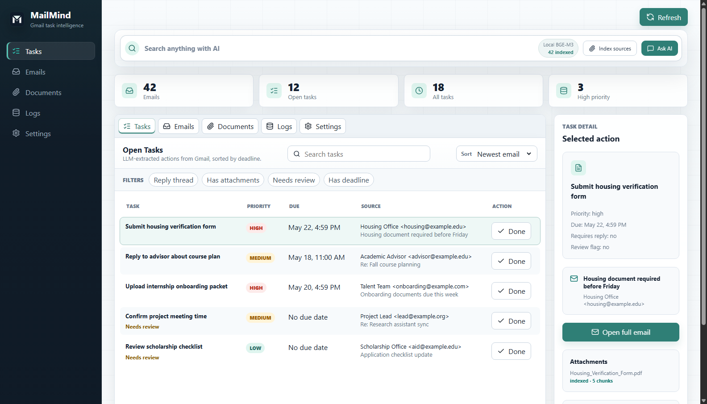
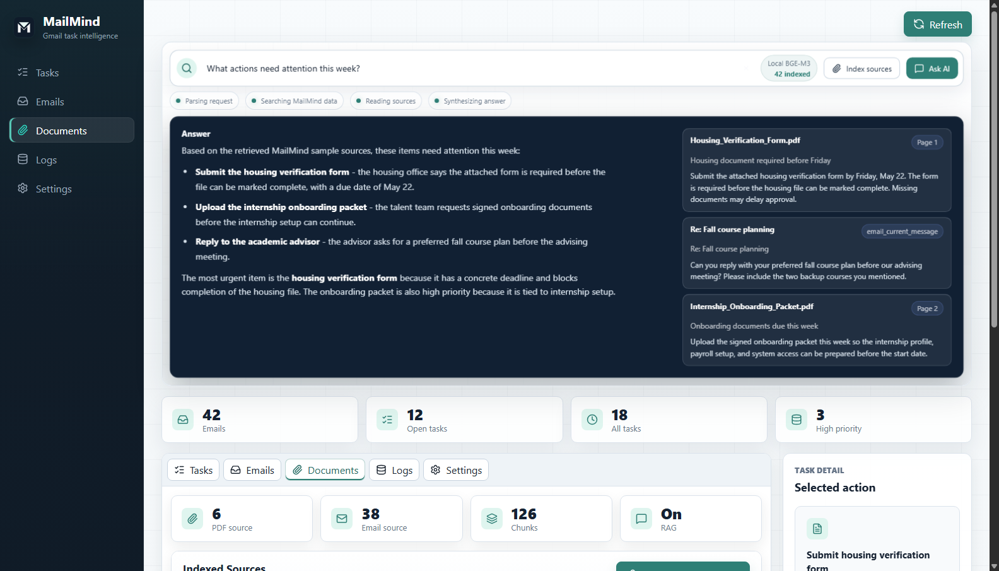

# MailMind

[English](README.md) | [中文](README.zh.md)


MailMind 是一个 local-first 的 Gmail 智能助手，可以把拥挤的邮箱转成任务系统、可搜索的信息层，以及带隐私边界的个人工作流。

它通过 Gmail 只读 API 拉取邮件，用 LLM 提取行动项，把数据保存在本地 SQLite，并提供 dashboard、基于 RAG 的邮件正文与 PDF 附件搜索能力、Telegram 提醒，以及可配置的隐私控制。

## 为什么它不一样

很多邮箱工具要么只停留在规则筛选，要么要求你把整个邮箱交给托管服务。

MailMind 走的是另一条路线：

- **默认 local-first**：数据库、附件和索引都留在你的机器上。
- **结构化任务抽取**：从杂乱的邮件线程里提取 deadline、待回复、待处理和待审核事项。
- **带来源依据的 AI Search**：回答会附上 source cards，而不是无依据的聊天式输出。
- **统一的产品闭环**：FastAPI、Next.js、SQLite、Gmail OAuth、scheduler、Telegram、RAG 和隐私边界不是分散的 demo，而是在同一个项目里一起工作。
- **适合公开演示**：仓库内包含 synthetic demo assets，可以安全展示产品而不暴露真实邮箱数据。

## 一次刷新后你会得到什么

```text
最近的邮箱动态
  -> 带 due date 和 reply-needed 标记的结构化任务
  -> 可搜索的邮件正文和 PDF 附件
  -> 带来源依据的 inbox 问题回答
  -> 可选的 Telegram 提醒和定时 follow-up
```

## 核心能力

- 一键刷新 Gmail，把最近邮件转成结构化任务。
- 跟踪 due date、priority、是否需要回复、是否需要复核。
- 对邮件正文和 text-layer PDF 附件做 hybrid retrieval 搜索。
- 直接提问 inbox 问题，并拿到带来源依据的答案。
- 用 Telegram 跑提醒和轻量交互。
- 在原文直发 LLM 与 PII rehydration 之间切换。
- 用 synthetic sample data 安全演示完整产品，而不用暴露真实邮箱内容。

## 界面预览





仓库里的截图不包含真实邮件、OAuth token、API key 或私人附件。

## 快速导航

- [为什么它不一样](#为什么它不一样)
- [一次刷新后你会得到什么](#一次刷新后你会得到什么)
- [核心能力](#核心能力)
- [快速开始](#快速开始)
- [接入真实 Gmail](#接入真实-gmail)
- [流程概览](#流程概览)
- [AI Search 和 RAG](#ai-search-和-rag)
- [隐私模型](#隐私模型)
- [可选服务](#可选服务)
- [仓库结构](#仓库结构)
- [下一步该看什么](#下一步该看什么)
- [项目状态和边界](#项目状态和边界)

## 快速开始

如果你只是想先看产品效果，建议先跑 demo mode。它不需要 Gmail credentials，也不需要付费 API 调用。

### 快速路径

```bash
git clone https://github.com/Parsiffal1/Mailmind.git
cd Mailmind
python3 -m venv .venv
source .venv/bin/activate
pip install -r requirements.txt
cp .env.example .env
```

在 `.env` 里设置：

```text
MAILMIND_LLM_PROVIDER=mock
```

然后构建 dashboard 并启动 API：

```bash
cd dashboard
npm install
npm run build
cd ..
python -m mailmind.api
```

打开：

```text
http://127.0.0.1:8000/?demo=1
```

### Windows PowerShell

```powershell
git clone https://github.com/Parsiffal1/Mailmind.git
cd Mailmind
python -m venv .venv
.\.venv\Scripts\Activate.ps1
pip install -r requirements.txt
Copy-Item .env.example .env
```

设置：

```text
MAILMIND_LLM_PROVIDER=mock
```

然后运行：

```powershell
cd dashboard
npm install
npm run build
cd ..
python -m mailmind.api
```

## 接入真实 Gmail

1. 打开 Google Cloud Console。
2. 创建或选择一个项目。
3. 启用 Gmail API。
4. 配置 Google Auth Platform consent screen，个人项目可使用 external testing。
5. 创建 OAuth client ID，类型选择 `Desktop app`。
6. 下载 OAuth client JSON，保存到项目根目录并命名为 `credentials.json`。
7. 在 Google Auth Platform 里把自己的 Gmail 加为 test user。

然后配置 `.env`：

```text
MAILMIND_LLM_PROVIDER=anthropic
ANTHROPIC_API_KEY=your_anthropic_api_key
MAILMIND_GMAIL_CREDENTIALS=credentials.json
MAILMIND_GMAIL_TOKEN=token.json
MAILMIND_POLL_QUERY=newer_than:14d
MAILMIND_POLL_LIMIT=40
```

运行：

```powershell
python -m mailmind.api
```

打开 `http://127.0.0.1:8000`，点击 `Refresh`，完成浏览器 OAuth 授权。第一次登录成功后，MailMind 会在本地写入 `token.json`。

## 流程概览

```text
Refresh
  -> 通过只读 OAuth 拉取 Gmail
  -> 在本地归一化邮件与附件
  -> 用经过校验的 LLM 输出提取行动项
  -> 更新任务视图和搜索索引
  -> 用检索到的来源回答 inbox 问题
```

```text
Gmail readonly OAuth
        |
        v
FastAPI backend + SQLite
        |
        +--> LLM task extraction -> tasks, deadlines, priorities
        |
        +--> AI search index -> email chunks + PDF chunks
        |                         -> Chroma vector search + SQLite FTS5
        |
        +--> Next.js dashboard
        |
        +--> APScheduler worker + Telegram bot
```

## AI Search 和 RAG

MailMind 可以索引 Gmail 邮件正文、text-layer PDF 附件，或两者同时启用。

检索流程包括：

- structure-aware email/PDF chunking；
- child chunks 用于 embedding 和 search；
- parent context 用于最终发送给 Claude；
- Chroma vector retrieval，本地 BGE-M3 embedding；
- SQLite FTS5 BM25 keyword retrieval；
- fusion、reranking、source grouping、deduplication 和 score aggregation；
- Claude 基于 source-labeled context 回答。

当前 50-case post-improvement benchmark（见 `eval/RAG_EVALUATION_RESULTS.md`）：

| 指标 | Vector-only | Hybrid after | 提升 |
| --- | ---: | ---: | ---: |
| Top-1 Source Recall | 48.35% | 63.74% | +15.39 pp |
| Any-source Recall@4 | 58.24% | 78.02% | +19.78 pp |
| Full-source Recall@4 | 46.15% | 64.84% | +18.69 pp |
| MRR | 0.522 | 0.691 | +0.169 |

第一次本地 embedding 会通过 `sentence-transformers` 下载 `BAAI/bge-m3`。如果开启 reranking，第一次 rerank 查询会下载 `BAAI/bge-reranker-base`。

## 隐私模型

MailMind 支持两条路线：

- `off`：Claude 直接看到原文。
- `rehydrated`：MailMind 先把选定的 PII 替换成 placeholder，再发送给 Claude，最后在本地恢复答案。

PII Guard 覆盖 email、phone、SSN、ID-like values、account-like numbers、API keys/tokens/secrets 和保守英文姓名检测。日期默认保留，避免影响 deadline extraction 和 RAG answer。

这只是隐私风险缓解，不是合规认证。本地 SQLite、下载附件、Chroma index 和 FTS index 不会被全局脱敏。

## 可选服务

Scheduler worker:

```powershell
python -m mailmind.worker
```

Telegram bot:

```powershell
python -m mailmind.bot
```

Telegram 需要：

```text
TELEGRAM_BOT_TOKEN=your_telegram_bot_token
TELEGRAM_CHAT_ID=your_chat_id
MAILMIND_TELEGRAM_NOTIFICATIONS_ENABLED=true
```

## 仓库结构

```text
mailmind/          FastAPI 后端、Gmail client、抽取、数据库、RAG、worker、bot
dashboard/         Next.js dashboard，静态导出后由 FastAPI 托管
prompts/           Claude task extraction 和 RAG answer prompts
tests/             parser、database、API、extraction、RAG、privacy 的测试
scripts/           demo asset 生成、RAG evaluation、GitHub 发布辅助脚本
docs/              demo flow、PII 架构、README 资源和截图
eval/              RAG evaluation seed file 和评估报告
```

## 下一步该看什么

- Demo walkthrough: [docs/DEMO_FLOW.md](docs/DEMO_FLOW.md)
- PII architecture: [docs/PII_ARCHITECTURE.md](docs/PII_ARCHITECTURE.md)
- Security notes: [SECURITY.md](SECURITY.md)
- Demo assets: [docs/demo/GITHUB_ASSETS.md](docs/demo/GITHUB_ASSETS.md)
- Brand GIF storyboard: [docs/demo/MAILMIND_BRAND_GIF_STORYBOARD.md](docs/demo/MAILMIND_BRAND_GIF_STORYBOARD.md)

## RAG Evaluation

把评估问题加入 `eval/rag_eval.json` 后运行：

```powershell
python scripts\eval_rag.py --mode vector --top-k 4
python scripts\eval_rag.py --mode hybrid --top-k 4
```

评估脚本会输出 source recall 和检索到的 source labels。synthetic/hard-negative evaluator 会创建临时本地 index，生成的 index 数据不要提交到 GitHub。

## 项目状态和边界

MailMind 是一个可以本地运行的 MVP，适合个人使用、作品集展示和继续开发。

当前边界：

- 不是公开托管 SaaS；
- 没有多人账号体系；
- 不支持 scanned PDF OCR；
- 没有完成 Google OAuth restricted-scope 生产审核；
- PII Guard 不声明合规认证；
- 暂未实现 Gmail push notification 实时触发。

## 社区协作

欢迎 issue 和 pull request。适合优先改进的方向包括文档修正、retrieval evaluation cases、UI polish、setup automation，以及更安全的本地隐私默认配置。

请不要在 issue 里贴真实邮件内容、OAuth token、API key 或私人附件。提问题前优先使用 `.github/ISSUE_TEMPLATE/` 中的模板；如果涉及敏感复现信息，请先阅读 [SECURITY.md](SECURITY.md)。

## License

MIT
