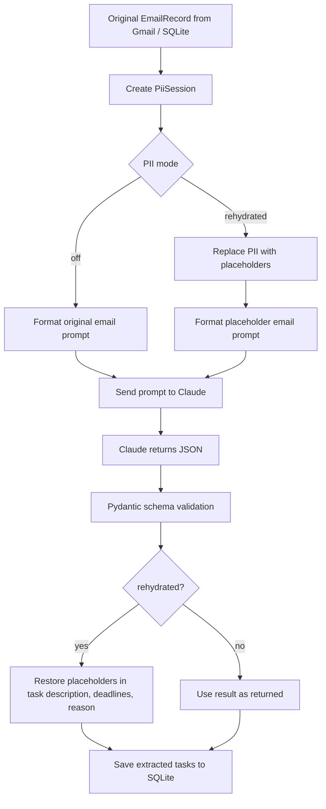
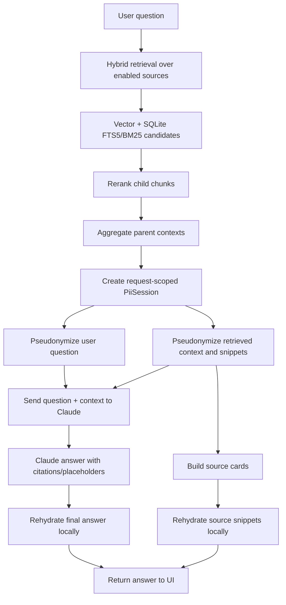
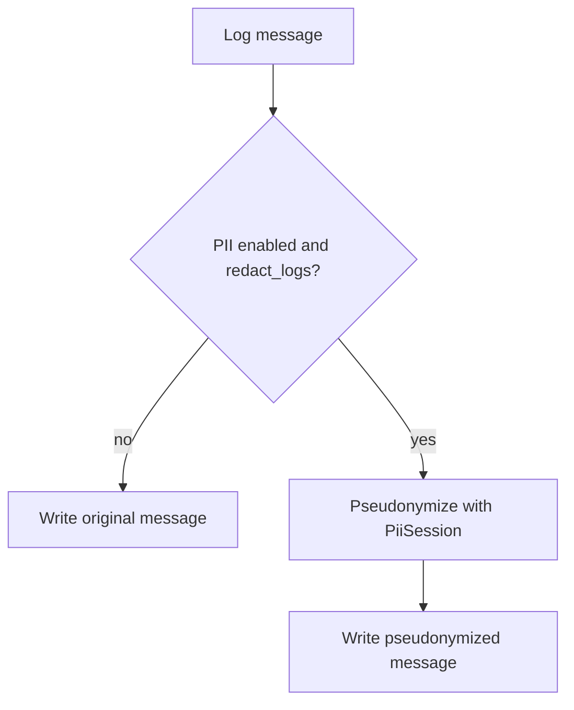

# MailMind PII Guard Architecture

## Purpose

MailMind PII Guard is a local-first privacy boundary for LLM calls. Its goal is to reduce the amount of directly identifiable text sent to Claude while preserving a readable user experience inside the local app.

This is not a compliance certification, irreversible anonymization system, or complete PII detector. It is an application-level pseudonymization layer for the LLM boundary.

## Current Modes

MailMind supports two user-facing privacy modes.

| Mode | Claude sees | User sees | Local SQLite / index |
| --- | --- | --- | --- |
| `off` | Original email/RAG text | Original text | Original text |
| `rehydrated` | Placeholder text such as `[PERSON_1]`, `[EMAIL_1]` | Locally restored final answer/source text | Original text |

The legacy value `llm_only` is still accepted by config parsing and is normalized to `rehydrated`.

## Configuration

Configuration is exposed through the Settings page and persisted to `.env`.

```text
MAILMIND_PII_ENABLED=true
MAILMIND_PII_MODE=rehydrated
MAILMIND_PII_REDACT_NAMES=true
MAILMIND_PII_PRESERVE_DATES=true
MAILMIND_PII_REDACT_LOGS=true
```

Backend entry points:

- `mailmind/config.py`: reads PII environment variables into `Settings`.
- `mailmind/api.py`: exposes PII fields through `GET /api/settings` and writes them through `PUT /api/settings`.
- `dashboard/app/page.jsx`: renders the Settings UI for PII mode selection and related toggles.

## Core Components

### `PiiConfig`

Defined in `mailmind/privacy.py`.

`PiiConfig` is the immutable runtime configuration passed into the PII layer.

Fields:

- `enabled`: global PII guard switch.
- `mode`: `off` or `rehydrated`.
- `redact_names`: enables conservative English person-name detection.
- `preserve_dates`: retained as policy config. The current regex detector does not redact dates by default.
- `redact_logs`: controls whether processing logs are pseudonymized.

### `PiiSession`

Defined in `mailmind/privacy.py`.

`PiiSession` is the request-scoped pseudonymization object. It owns the mapping between real values and placeholders.

Example:

```text
Alex Chen        -> [PERSON_1]
alex@example.edu -> [EMAIL_1]
123-45-6789     -> [SSN_1]
```

Internally it stores:

```python
placeholder_to_value = {
    "[PERSON_1]": "Alex Chen",
    "[EMAIL_1]": "alex@example.edu",
}
```

It also stores a reverse map so the same value receives the same placeholder within one request:

```text
Alex Chen -> [PERSON_1]
Alex Chen -> [PERSON_1]
```

The mapping is in memory only for that extraction or RAG request. It is not written to SQLite, Chroma, logs, or `.env`.

## Detected PII Types

The current detector is regex and rules based.

| Type | Placeholder | Detection strategy |
| --- | --- | --- |
| Secrets / API keys / tokens | `[SECRET_N]` | regex patterns for `sk-*`, `sk-ant-*`, Slack-style tokens, and labeled token/key/password values |
| SSN | `[SSN_N]` | US SSN pattern `123-45-6789` |
| Email address | `[EMAIL_N]` | email regex |
| Phone number | `[PHONE_N]` | US-style phone regex with optional extension |
| Labeled ID values | `[ID_N]` | labeled student/employee/account/case/client/member/record IDs |
| Account-like numbers | `[ACCOUNT_N]` | 12-19 digit account-like sequences |
| English person names | `[PERSON_N]` | conservative capitalized two/three-token pattern plus stopword filters |

The name detector intentionally avoids aggressive matching. It skips many organization, department, course, title, and date-like phrases to reduce false positives in email subjects and school/admin text.

Known limitations:

- Chinese names are not strongly detected.
- Ambiguous organization/person names may be missed or incorrectly skipped.
- Some capitalized phrases may still be false positives.
- Regex detection does not provide the coverage of Presidio or model-based PII detection.

## Task Extraction Flow

Task extraction uses `mailmind/extractor.py`.



Important properties:

- The original `EmailRecord` is not mutated.
- Claude receives placeholder text only in `rehydrated` mode.
- The task shown and stored locally is restored before saving.
- Dates are preserved because deadline extraction depends on them.
- The prompt instructs Claude to preserve placeholders exactly.

Example:

```text
Original:
Alex Chen must submit SSN verification by May 22.

Claude prompt in rehydrated mode:
[PERSON_1] must submit [SSN_1] verification by May 22.

Claude JSON:
{"description": "Submit [SSN_1] verification", ...}

Local restored task:
Submit SSN verification
```

If Claude rewrites, drops, or paraphrases a placeholder, local rehydration cannot restore that value. This is why the extraction prompt contains explicit placeholder-preservation rules.

## RAG / AI Search Flow

RAG question answering uses `mailmind/rag.py`.



RAG source scope is controlled separately from PII:

- `MAILMIND_RAG_EMAIL_ENABLED`
- `MAILMIND_RAG_PDF_ENABLED`

Even if old chunks remain in Chroma/FTS, `LangChainRagIndex.ask()` filters retrieved documents by enabled source type before sending context to Claude.

PII handling is applied after retrieval and parent-context aggregation, not during indexing. That means:

- Chroma and SQLite FTS store original text.
- Retrieval quality is not degraded by placeholder replacement.
- Claude receives pseudonymized context in `rehydrated` mode.
- The UI receives restored answer/source text.

## Logging Flow

Processing logs use `Database.log()` in `mailmind/db.py`.



Logs are not rehydrated. This is intentional: processing logs are diagnostic artifacts, not user-facing final answers. They should avoid storing raw tokens, emails, phone numbers, and SSNs when PII log redaction is enabled.

Example:

```text
Original log:
Failed for alex@example.edu token=sk-test123456789 SSN 123-45-6789

Stored log:
Failed for [EMAIL_1] [SECRET_1] SSN [SSN_1]
```

## Data Boundary

The PII Guard boundary is deliberately placed at LLM calls and logs.

| Data location | Current behavior |
| --- | --- |
| Gmail API response in memory | Original text |
| SQLite `emails` table | Original text |
| SQLite `tasks` table | Restored text in `rehydrated` mode |
| SQLite `processing_logs` | Pseudonymized if `redact_logs=true` |
| Chroma vector store | Original indexed chunks |
| SQLite FTS5 RAG index | Original indexed chunks |
| Claude extraction prompt | Original in `off`, placeholders in `rehydrated` |
| Claude RAG prompt | Original in `off`, placeholders in `rehydrated` |
| Dashboard email detail | Original text |
| Dashboard AI answer | Restored text in `rehydrated` |
| Dashboard RAG source snippets | Restored text in `rehydrated` |

This design prioritizes:

- high retrieval quality,
- local user readability,
- low complexity,
- no persistent mapping table,
- clear local-first ownership of raw data.

It does not attempt to make local storage anonymous.

## Security Properties

What this implementation does provide:

- Reduces direct PII exposure in Claude prompts when `rehydrated` mode is enabled.
- Keeps rehydration mapping local and request-scoped.
- Prevents the LLM provider from seeing raw detected values in task extraction and RAG QA prompts.
- Allows the user to read restored final answers without exposing the mapping to the LLM.
- Avoids degrading vector search by keeping indexing over original local text.

What it does not provide:

- Full anonymization.
- Compliance with HIPAA, FERPA, GDPR, or other regulatory regimes.
- Complete PII detection.
- Protection if local SQLite, attachment files, Chroma, or FTS index are compromised.
- Protection from undetected PII being sent to Claude.
- Protection from PII in metadata types not covered by the detector.
- Guaranteed rehydration if Claude modifies placeholder strings.

## High-Risk Detail: Rehydration Policy

Current `rehydrated` mode can restore any placeholder type that appears in the LLM output, including high-risk types such as:

- `[SSN_N]`
- `[SECRET_N]`
- `[ACCOUNT_N]`

This matches the current product goal: user-readable local output. However, a stricter industrial policy would usually separate display restoration by sensitivity.

Recommended future policy:

| Placeholder type | Recommended UI restoration |
| --- | --- |
| Person names | restore |
| Email addresses | restore or partially mask |
| Phone numbers | restore or partially mask |
| Student IDs / account numbers | mask by default |
| SSN | never fully restore in AI answers |
| Secrets / tokens | never restore |

An improved rehydration function could support:

```python
rehydrate_text(text, restore_types={"person", "email", "phone"})
```

and keep `[SSN_1]` / `[SECRET_1]` masked in final AI output.

## Failure Modes

### Placeholder Mutation

If Claude changes `[PERSON_1]` to `Person 1`, `[PERSON]`, or omits it, local rehydration cannot restore the original value.

Mitigation already implemented:

- Prompts instruct Claude to preserve placeholders exactly.

Possible future mitigation:

- Post-response validation for unresolved or malformed placeholder-like text.
- Retry Claude with stronger repair instruction.

### False Negatives

If regex detection misses a PII span, the raw span can be sent to Claude.

Examples:

- uncommon ID formats,
- non-US phone numbers,
- Chinese names,
- names with uncommon capitalization,
- addresses,
- medical/financial details not covered by current regex.

Future mitigation:

- Add Microsoft Presidio as a detector backend.
- Add OpenAI Privacy Filter or another local model detector.
- Add address and location detection.
- Add test cases for real Gmail-like text.

### False Positives

The detector may replace non-PII text with placeholders.

Impact:

- Claude may receive less context.
- Rehydration may restore harmless text in final answers.

Current mitigation:

- Conservative name stopword list.
- Date/title skip logic.

### Mapping Scope Loss

Mappings are request-scoped. If a placeholder is stored and later used outside the original request, it cannot be restored.

Current behavior:

- Extraction restores before saving tasks.
- RAG restores before returning to UI.
- Logs intentionally do not restore.

## Tests

Current tests cover:

- masking high-risk PII,
- date preservation,
- local rehydration,
- `off` mode behavior,
- extraction prompt not containing raw PII,
- extraction result rehydration,
- RAG prompt context pseudonymization,
- RAG answer/source rehydration,
- processing log pseudonymization,
- settings API persistence.

Representative command:

```powershell
python -m pytest tests\test_privacy.py tests\test_settings_api.py -q
```

## Recommended Next Iteration

For a stronger production-style PII architecture:

1. Add a detector interface:

   ```python
   class PiiDetector:
       def detect(text: str) -> list[PiiSpan]:
           ...
   ```

2. Keep the current regex detector as `RegexPiiDetector`.

3. Add optional `PresidioPiiDetector`.

4. Add restoration policy by PII type:

   ```text
   restore names/emails
   mask SSNs/secrets/accounts
   ```

5. Add span-offset based replacement instead of chained regex substitutions.

6. Add audit metadata without raw values:

   ```json
   {
     "pii_types": ["email", "person", "ssn"],
     "counts": {"email": 1, "person": 2, "ssn": 1}
   }
   ```

7. Add UI indicator on AI answers:

   ```text
   PII mode: Rehydrated locally
   Claude saw placeholders, not raw detected values.
   ```

## Summary

MailMind's current PII Guard is a pragmatic local-first LLM boundary:

- `off` mode favors simplicity and full model context.
- `rehydrated` mode favors privacy-aware LLM prompting while preserving readable local output.
- Raw data remains local for dashboard review and retrieval quality.
- The system reduces PII exposure to Claude but does not replace a dedicated enterprise PII platform or compliance program.
